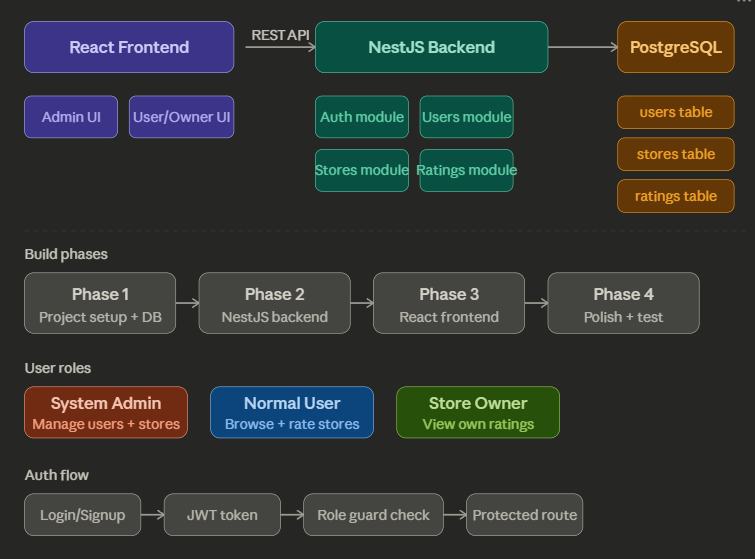

# Store Rating App



## Tech Stack
- Backend: NestJS
- Database: PostgreSQL
- Frontend: ReactJS

## Setup Instructions

### Backend
```bash
cd backend
npm install
# Create .env file with your DB credentials
npm run start:dev
```

### Frontend
```bash
cd frontend
npm install
npm run dev
```

## Default Admin Login
- Email: admin@store.com
- Password: Admin@123

## Features
- Role based login (Admin, User, Store Owner)
- Admin dashboard with stats, user and store management
- Normal user can browse and rate stores
- Store owner can view ratings dashboard
