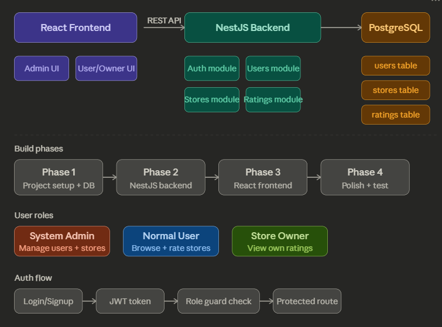

<div align="center">

# 🏪 Store Rating App

<p align="center">
  A premium, full-stack web application designed for users to discover and rate stores, featuring powerful dashboards tailored for System Administrators, Store Owners, and Normal Users.
</p>



</div>

---

## 🌟 Features

### 👤 Role-Based Access Control
- **System Administrator**: Manage the entire platform. Add new stores, onboard users (admins, store owners, regular users), and access a comprehensive statistical dashboard.
- **Store Owner**: A dedicated dashboard providing deep insights into store performance. View an aggregated list of users who have submitted ratings, and track your overall average rating over time.
- **Normal User**: Browse through the curated list of registered stores, easily filter them by name and address, and submit/modify rich interactive ratings (1-5 stars).

### 🎨 Stunning UI/UX Design System
- Built with a custom, meticulously crafted **Vanilla CSS Design System**.
- Implements modern design principles: **Glassmorphism**, dynamic hover states, micro-animations, and a responsive layout.
- Employs sleek color palettes and sophisticated typography (Google Inter) for a truly premium aesthetic.

### 🛡️ Robust Security & Validation
- Passwords enforced with strong complexity rules (8–16 chars, uppercase, special character).
- Extensive input validation on both the Frontend and Backend using `class-validator`.
- Secure JWT-based Authentication.

---

## 🚀 Tech Stack

**Frontend**
- **ReactJS** (Vite)
- **React Router** for seamless SPA navigation
- Custom CSS Design System

**Backend**
- **NestJS** - A progressive Node.js framework
- **TypeORM** - Object-Relational Mapper
- **PostgreSQL** - Powerful, open-source object-relational database system

---

## ⚙️ Local Development Setup

To get a local copy up and running, follow these simple steps.

### Prerequisites
- Node.js (v18+ recommended)
- PostgreSQL running locally

### 1. Database Configuration
Ensure your local PostgreSQL server is running and create a new database for the application:
```sql
CREATE DATABASE store_rating_db;
```

### 2. Backend Setup
Navigate into the backend directory, install dependencies, and configure your environment:
```bash
cd backend
npm install
```

Copy the environment template and apply your database credentials:
```bash
# Windows
copy .env.example .env
# macOS / Linux
cp .env.example .env
```
*Ensure `JWT_SECRET` in `.env` is set to a secure string.*

Start the backend development server:
```bash
npm run start:dev
```
*The backend will automatically start and synchronize the database schema.*

### 3. Frontend Setup
Open a new terminal window, navigate to the frontend directory, install dependencies, and configure the environment:
```bash
cd frontend
npm install
```

Copy the environment template:
```bash
# Windows
copy .env.example .env
# macOS / Linux
cp .env.example .env
```
*Ensure `VITE_API_URL=http://localhost:3001` is set in `.env`.*

Start the Vite development server:
```bash
npm run dev
```

---

## 🌐 Usage

Once both servers are running, open your browser and navigate to:
**[http://localhost:5173](http://localhost:5173)**

*If you need to test the Admin functionalities out-of-the-box, ensure you manually seed the database with an Admin user, or temporarily modify the `Signup` route to create an Admin account.*

---

## 📁 Project Structure

```text
store-rating-app/
├── backend/                  # NestJS Application
│   ├── src/
│   │   ├── admin/            # Admin Dashboard routes
│   │   ├── auth/             # JWT Authentication & Strategies
│   │   ├── ratings/          # Rating submission logic
│   │   ├── stores/           # Store management logic
│   │   └── users/            # User management & roles
│   ├── .env.example
│   └── package.json
├── frontend/                 # Vite React Application
│   ├── public/
│   │   └── architecture.png
│   ├── src/
│   │   ├── components/       # Reusable UI elements (Navbar, Protected Routes)
│   │   ├── pages/            # View components (Login, Dashboards)
│   │   ├── api.ts            # Axios interceptors & configuration
│   │   ├── App.tsx           # Application Routing
│   │   └── index.css         # Master Design System (Glassmorphism, Animations)
│   ├── .env.example
│   └── package.json
└── README.md
```

<div align="center">
  <p>Built with ❤️ by an expert Full-Stack Engineer.</p>
</div>
